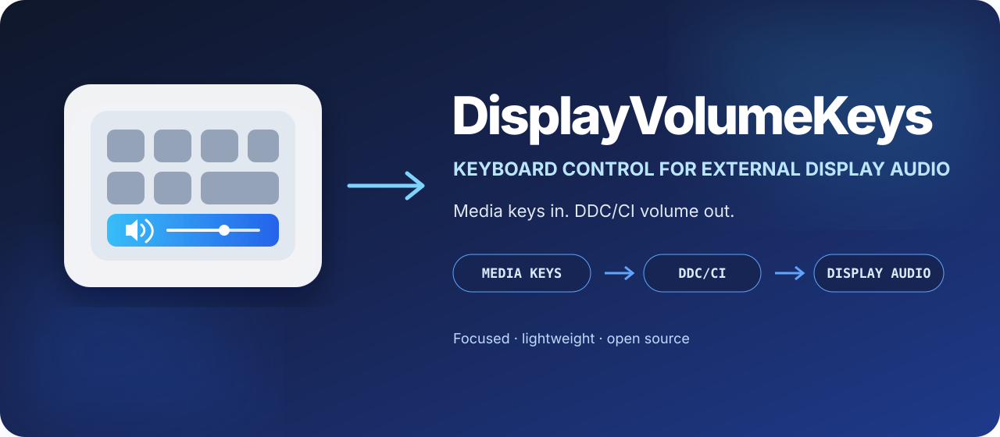
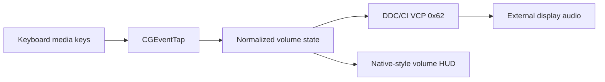

<div align="center">
  

  <br />

  [](https://www.apple.com/macos/)
  [](LICENSE)
  [](Package.swift)

  **Use any keyboard's volume keys to control audio on a DDC/CI external display.**

  [Quick start](#quick-start) · [How it works](#how-it-works) · [Mute behavior](#important-mute-behavior) · [Troubleshooting](#troubleshooting)
</div>

---

## What is DisplayVolumeKeys?

**DisplayVolumeKeys** is a focused, open-source macOS menu-bar app. It maps volume up, volume down, and mute media keys to an external display's DDC/CI audio control and shows an accurate native-style volume HUD.

The project is inspired by [BetterDisplay](https://github.com/waydabber/BetterDisplay). I built it after experiencing a BetterDisplay memory leak in my own setup and wanting its useful keyboard-to-display volume behavior without virtual displays, scaling, HDR controls, display overrides, or other unrelated functionality.

## What works

| Capability | Status |
| --- | :---: |
| Volume up, volume down, and held-key repeat | ✅ |
| Media keys from Apple and third-party keyboards | ✅ |
| DDC/CI speaker volume (`VCP 0x62`) | ✅ |
| Displays with valid DDC reads | ✅ |
| Write-only displays with malformed reads | ✅ Cached level |
| Accurate native-style volume HUD | ✅ |
| Automatic launch at login | ✅ `SMAppService` |
| Root helper, kernel extension, or virtual audio driver | ❌ Not required |

## Quick start

### Requirements

- macOS 13 or later on Apple Silicon
- A DDC/CI display with audio-volume control
- Swift 5.10 or later to build from source

```bash
git clone https://github.com/TurabiOzturk/DisplayVolumeKeys.git
cd DisplayVolumeKeys
./Scripts/install-app.sh
```

The script builds and locally signs the app, installs it at `/Applications/DisplayVolumeKeys.app`, and launches it.

On first launch, enable **DisplayVolumeKeys** under:

> System Settings → Privacy & Security → Accessibility

The app automatically registers itself as a login item on first launch. You can change that setting from its menu-bar menu.

## Important mute behavior

> [!IMPORTANT]
> On a display that cannot reliably report its DDC state, **both the mute key and volume zero use the safe lowest-volume fallback**. They do not send the separate DDC hardware-mute command.

Some displays accept a hardware-mute command but fail to accept the corresponding standard unmute command. That can leave their audio stuck muted until mute is toggled with the display's physical controls.

DisplayVolumeKeys avoids that failure mode. It saves the previous level, writes speaker volume `0`, and restores the saved level when unmuted. A faint output may remain when the display treats zero as its lowest amplifier level rather than true silence. This is an intentional safety tradeoff.

## How it works



1. A `CGEventTap` captures standard volume media keys while a compatible display is active.
2. The current audio output is matched to a physical display through Core Audio and I/O Registry metadata.
3. [`AppleSiliconDDC`](https://github.com/waydabber/AppleSiliconDDC) sends volume commands through Apple's `IOAVService` I²C interface.
4. Valid DDC values are normalized; write-only displays use a locally cached level.
5. The app shows the system OSD where level updates work and a small reusable AppKit HUD where they do not.

## Compatibility

DDC behavior depends on the display firmware and whether the connection forwards monitor-control commands. Direct connections are generally more reliable than docks or adapters. DisplayLink and virtual-display transports commonly do not forward DDC.

If no compatible display is matched, DisplayVolumeKeys leaves normal macOS media-key handling untouched.

## Troubleshooting

### Keys do nothing

1. Confirm the menu-bar item reports a connected display.
2. Enable DisplayVolumeKeys in Accessibility settings.
3. If an older local build was previously approved, toggle permission off and on.
4. Choose **Reconnect to Monitor** from the menu-bar menu.

Reset only this app's Accessibility decision if needed:

```bash
tccutil reset Accessibility com.turabiozturk.DisplayVolumeKeys
open /Applications/DisplayVolumeKeys.app
```

### HUD moves but volume does not

The connection may not forward DDC, or the display may not implement MCCS speaker volume. Try a direct connection and verify that DDC/CI is enabled in the display's settings.

### Mute is not perfectly silent

This is the safe behavior described above: the display treats volume zero as a non-silent minimum, while its hardware-mute command cannot be used safely without a reliable unmute path.

## Development

Build without installing:

```bash
./Scripts/build-app.sh
```

The app bundle is written to `build/DisplayVolumeKeys.app`. Local builds use a stable designated requirement so rebuilding does not repeatedly invalidate Accessibility permission.

## Privacy and private APIs

DisplayVolumeKeys has no telemetry and makes no runtime network requests. It observes only volume-related media keys while a compatible display is active.

Apple does not publish supported APIs for every DDC transport or for caller-controlled system OSD levels. The project therefore uses undocumented interfaces also used by established display-control applications. These may change in future system releases, and the app is not intended for the Mac App Store.

## Contributing

Issues and pull requests are welcome. Include only the compatibility information you intentionally choose to disclose. Never post serial numbers, system profiles, logs containing identifiers, or other private device metadata.

See [`CONTRIBUTING.md`](CONTRIBUTING.md) for development guidance.

## Acknowledgments

- [BetterDisplay](https://github.com/waydabber/BetterDisplay), which inspired this focused utility
- [`AppleSiliconDDC`](https://github.com/waydabber/AppleSiliconDDC) by Istvan Toth / waydabber
- [`MonitorControl`](https://github.com/MonitorControl/MonitorControl) for its open-source DDC and media-key work
- The VESA DDC/CI and MCCS standards

## License

Source code and original project artwork are available under the [MIT License](LICENSE).
